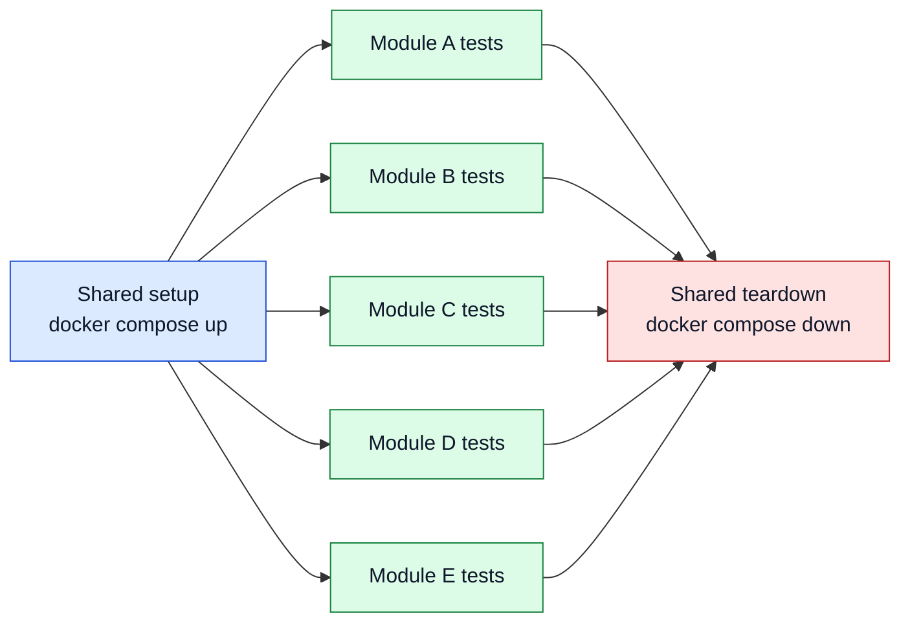

# Faster Integration Tests with Docker Compose (Instead of Per-Module Testcontainers)

Testcontainers is a great tool. It gives excellent isolation, a convenient API, and it has improved application testing dramatically over the last years.

Before Testcontainers became mainstream, many teams either relied on fragile shared test databases or overused mocks that hid integration problems until late stages. Testcontainers changed that by making real dependencies easy to start in tests, with reproducible versions and controlled lifecycle. As a result, integration tests became more realistic, local and CI behavior became more consistent, and teams gained confidence that authentication, persistence, messaging, and migrations actually work together before production.

Quarkus Dev Services follow the same spirit and are also excellent for day-to-day work. They are especially convenient when you want a zero-friction local setup.

The challenge appears when the project scales. In large multi-module Maven builds, the default "each module starts its own dependencies" pattern can become the bottleneck. At that point, a shared `docker-compose` stack is often a better engineering choice.

This is not only about module parallelism. It also improves the everyday IDE loop: when the shared stack is already up, running one integration test does not require waiting for all containers to start again.

This article focuses on that context: preserving realistic infrastructure tests while reducing startup overhead for both CI and local development.

## The problem in multi-module builds

In a small project, per-module containers are fine. In a large codebase, the same pattern can become expensive:

- Repeated startup cost for the same infrastructure
- CPU and memory spikes when modules run in parallel
- CI flakiness from transient resource exhaustion
- Unpredictable build duration when the host is under load

A concrete example: starting Quarkus Dev Services Keycloak is often around **20 seconds**. That is acceptable once. It is painful when repeated across many modules.

Imagine a build where 6 modules each trigger the same Keycloak startup sequence. Even before database and broker initialization, you can burn minutes only on repeated container bootstrapping.

The bigger issue is not just time, it is contention. If all modules do this concurrently, the machine may spend more time context switching and waiting for I/O than running your tests.

## Why shared Compose helps

The idea is simple:

- Start one shared environment with `docker compose up -d`
- Run all integration tests against that environment
- Tear it down once at the end

You trade strict per-suite isolation for speed and host stability.

For many teams, this is the right trade in CI and local feedback loops. You still test real infrastructure, but you avoid paying the startup tax over and over.

In practice, this usually produces three concrete gains:

- Lower total wall-clock test time
- Better Maven parallelization (`-T`) with fewer OOM-like failures
- More deterministic CI behavior under heavy load

## A simple timing model

It helps to reason about the savings with a rough model.

Suppose your integration dependencies take around 45 seconds to become ready (Keycloak, DB, broker, migrations). If 8 modules each spin up their own stack, startup overhead alone is about 6 minutes of cumulative wait time.

With a shared Compose stack, that startup happens once. Even if your tests then run against shared state and need slightly more careful data management, you usually win big on total duration.

This is why teams often report that "parallel Maven didn’t help" before moving to shared infra, and "parallel Maven finally works" after moving.

## Timeline comparison

The difference is easiest to understand as two separate flows.

Sequential per-module startup:


Shared Docker Compose + parallel module tests:



In the second model, expensive infrastructure startup and teardown happen once, while test modules can execute in parallel on top of the same running services.

## Reuse one stack for integration and E2E

The same Compose definitions can serve multiple workflows if you model them as two run modes:

- Integration mode: start only external dependencies (DB, Keycloak, broker, etc.)
- Full mode: start dependencies plus your backend service for E2E-style scenarios

In this setup, "full" is simply a Docker Compose profile defined in the Compose file (`profiles: [full]`), not a Maven profile.

Example:

```yaml
services:
  postgres:
    image: postgres:16
    environment:
      POSTGRES_DB: app
      POSTGRES_USER: app
      POSTGRES_PASSWORD: app

  keycloak:
    image: quay.io/keycloak/keycloak:26.0
    command: start-dev

  backend:
    image: my-backend:latest
    depends_on:
      - postgres
      - keycloak
    profiles: [full]
```

Commands:

```bash
# Integration mode: dependencies only
docker compose -f docker-compose.test.yml up -d

# Full mode: dependencies + backend (services tagged with profiles: [full])
docker compose -f docker-compose.test.yml --profile full up -d

# Tear down
docker compose -f docker-compose.test.yml down -v
```

That gives you one infrastructure contract reused in several places:

- Integration tests in CI
- E2E tests with the backend running in the stack
- Local troubleshooting and manual checks

This matters because duplicated environment definitions drift quickly. If integration tests use one stack and E2E uses another, subtle differences accumulate and failures become harder to reproduce.

A shared Compose baseline reduces that drift.

## Why Traefik makes this setup cleaner

Adding Traefik to the stack is a strong improvement, especially in larger systems.

Without a gateway, tests often depend on many host-port mappings. Those mappings are hard to keep stable and become noisy as services grow.

With Traefik, you can route by host/path and expose one entrypoint. This gives:

- Stable service addresses for tests
- Cleaner routing rules close to each service definition
- A topology closer to production traffic flow

Example Compose excerpt:

```yaml
services:
  traefik:
    image: traefik:v3.0
    command:
      - --providers.docker=true
      - --providers.docker.exposedbydefault=false
      - --entrypoints.web.address=:80
    ports:
      - "8080:80"
    volumes:
      - /var/run/docker.sock:/var/run/docker.sock:ro

  backend:
    image: my-backend:latest
    labels:
      - traefik.enable=true
      - traefik.http.routers.backend.rule=Host(`api.localhost`)
      - traefik.http.services.backend.loadbalancer.server.port=8080

  keycloak:
    image: quay.io/keycloak/keycloak:latest
    command: start-dev
    labels:
      - traefik.enable=true
      - traefik.http.routers.keycloak.rule=Host(`auth.localhost`)
      - traefik.http.services.keycloak.loadbalancer.server.port=8080
```

With this setup, test clients can consistently call `http://api.localhost:8080` and `http://auth.localhost:8080`.

It is easier to understand, easier to document, and easier to reuse across integration and E2E stages.

## Implication: test independence is non-negotiable

The speed gain from shared Compose comes with a cost: tests must be truly independent.

You can no longer assume:

- "The database is empty when my test starts"
- "No other test writes at the same time"
- "Entity IDs are predictable and sequential"

If those assumptions exist, parallel shared-environment testing will expose them quickly.

### Practical patterns that work

Use these rules consistently:

- Generate unique business keys per test (UUID suffixes, per-test namespaces)
- Insert only what each test needs
- Avoid global cleanup statements like `DELETE FROM table`
- Clean up only your test-owned records
- Assert by business key, not by row count of a shared table
- Design assertions tolerant to unrelated concurrent writes

A useful pattern is to stamp all test data with a `test_run_id` and scope queries to that value. This keeps tests isolated even inside one shared database.

Another pattern is to make writes idempotent in test setup. If setup may run twice, the second run should not fail or create ambiguous state.

## Maven wiring: baseline profile

A simple way to adopt this is a dedicated Maven profile that manages Compose lifecycle.

```xml
<profiles>
  <profile>
    <id>it-compose</id>
    <build>
      <plugins>
        <plugin>
          <groupId>org.codehaus.mojo</groupId>
          <artifactId>exec-maven-plugin</artifactId>
          <executions>
            <execution>
              <id>compose-up</id>
              <phase>pre-integration-test</phase>
              <goals><goal>exec</goal></goals>
              <configuration>
                <executable>docker</executable>
                <arguments>
                  <argument>compose</argument>
                  <argument>-f</argument>
                  <argument>docker-compose.test.yml</argument>
                  <argument>up</argument>
                  <argument>-d</argument>
                </arguments>
              </configuration>
            </execution>
            <execution>
              <id>compose-down</id>
              <phase>post-integration-test</phase>
              <goals><goal>exec</goal></goals>
              <configuration>
                <executable>docker</executable>
                <arguments>
                  <argument>compose</argument>
                  <argument>-f</argument>
                  <argument>docker-compose.test.yml</argument>
                  <argument>down</argument>
                  <argument>-v</argument>
                </arguments>
              </configuration>
            </execution>
          </executions>
        </plugin>
      </plugins>
    </build>
  </profile>
</profiles>
```

Then run:

```bash
mvn -P it-compose -T 1C verify
```

In CI, you can keep the stack up for the full integration phase and collect logs on failure before teardown.

## Migration strategy that avoids disruption

You do not need a big-bang move.

A low-risk sequence:

1. Introduce Compose profile and run one or two modules against it.
2. Fix non-isolated tests exposed by shared state.
3. Enable Maven parallelism gradually (`-T 1`, then `-T 1C`).
4. Move remaining modules.
5. Reuse the same stack for E2E profile.

This approach lets you measure improvements early without destabilizing the whole pipeline.

## What to measure

If you want to make this decision objectively, track a few metrics before and after:

- Total build duration
- Time spent before first integration test starts
- Number of CI retries due to infra flakiness
- Peak memory usage during integration phase
- Test throughput with Maven parallelism enabled

Even lightweight measurement is enough. The trend usually becomes obvious quickly.

## AI makes the setup much easier now

A few years ago, building a reliable Compose + Traefik test environment required significant manual effort.

Now AI tooling can produce most of the first version quickly: service definitions, Traefik labels, health checks, and profile wiring.

In practice, this can be almost entirely vibe-coded.

That does not remove engineering responsibility. Human review is still required for:

- Health check correctness
- Startup ordering and readiness
- Test data isolation rules
- Resource limits and failure behavior

AI is excellent for scaffolding. Reliability still comes from disciplined validation.

## Trade-offs and decision criteria

This is not a universal replacement for Testcontainers.

Use shared `docker-compose` when:

- You have a large multi-module project
- You need fast feedback and aggressive parallelism
- Repeated startup dominates your integration timeline
- You want the same infra shape for integration and E2E

Keep per-module or per-test Testcontainers when:

- Strong isolation per test suite is mandatory
- Infra startup time is small relative to test execution
- You frequently need custom one-off container topologies per suite

A hybrid model also works well in practice:

- Shared Compose for heavy common dependencies (DB, Keycloak, broker)
- Targeted Testcontainers only for special cases

This keeps the baseline fast while preserving flexibility where needed.

## Common pitfalls to avoid

Teams adopting shared Compose often hit the same problems first:

- Missing readiness checks (tests start before services are actually ready)
- Hidden dependence on clean DB state
- Port/routing drift between local and CI
- Teardown that removes useful diagnostics too early

A few safeguards prevent most pain:

- Add explicit health checks and wait logic
- Use deterministic test data scoping
- Keep a single routing strategy (Traefik) everywhere
- Preserve logs/artifacts on failure before `compose down`

## Conclusion

For large Maven builds, a shared Compose environment is often the pragmatic option: faster tests, fewer CI resource issues, and a direct path to reusable E2E infrastructure.

This pattern can be applied cleanly, especially with Traefik routing and a "full" profile that brings the backend into the same environment.

The key is to combine speed with discipline: one shared stack, independent tests, and careful readiness checks. When done well, you get much shorter feedback loops without sacrificing confidence.
