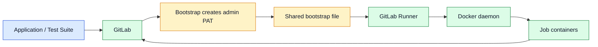
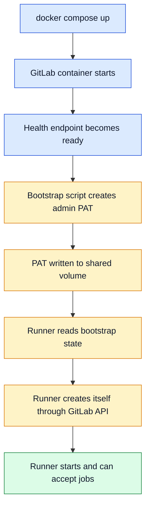

# Testing Against a Real GitLab Instance with Docker Compose

When an application depends on GitLab as part of its real behavior, mocks stop being enough surprisingly quickly.

If your system only needs to send one webhook or check one token, a fake server is often fine. But once GitLab becomes part of the core contract, reading repository files, writing configuration, creating project tokens, and eventually running CI jobs, the distance between "the mocked world" and "the real world" becomes expensive.

That was the context for a recent client project. The application under development had to interact with a GitOps repository stored in GitLab, so GitLab was part of the core behavior, not a peripheral integration. I wanted integration tests that exercised the actual GitLab API and a setup that could also run the relevant CI jobs in a realistic way.

The obvious concern is that GitLab is not lightweight. Running a real instance sounds like overkill at first glance.

In practice, it is feasible in a reasonable time.

With a focused Docker Compose setup, a small amount of bootstrap automation, and a local runner registered automatically, it is possible to test against a real GitLab instance locally without turning the developer workflow into a mess.

This article explains the structure of that setup and why it is a practical option when GitLab itself is part of what must be validated.

## When a mock is no longer the right abstraction

The key question is not "can I fake GitLab?" The key question is "what am I actually trying to validate?"

In my case, the important behaviors were things such as:

- authenticating against the GitLab API
- reading and writing repository content
- creating project-scoped access tokens
- using real project and branch identifiers
- running CI jobs through a real runner

None of those are exotic individually. The issue is their combination.

Once the application depends on several GitLab behaviors at the same time, mock-based tests start to prove less than they appear to prove. They validate your assumptions about GitLab more than they validate the integration itself.

That gap becomes even more visible when you want to validate the application under concurrent requests. A mock can confirm that one carefully scripted interaction works. It is much less convincing when several requests create, update, or read repository state at the same time and the behavior depends on GitLab's actual API, token model, and repository semantics.

For a client-facing project, that matters. If an integration is central to the product, the test setup should reflect that reality closely enough to catch the awkward parts early.

## Why Docker Compose was the right boundary

I wanted a setup with four properties:

- easy to start locally
- reproducible across machines
- close enough to production behavior to be meaningful
- usable both locally and in CI without redesigning everything

Docker Compose is a good fit for that combination.

It gives a clear boundary around the environment: GitLab, the runner, persistent volumes, networking, and readiness checks all live in one place. It also keeps the setup explicit. Instead of scattering shell snippets, local notes, and half-manual UI steps across a wiki, the environment becomes part of the project.

The goal here is not to build a perfect miniature production platform. The goal is to build a realistic, repeatable test environment with a reasonable cost.

That trade is often worth it when the external system is not incidental but central.

## The stack: GitLab plus a local runner

The Compose stack itself is conceptually simple:

- one `gitlab` service
- one `gitlab-runner` service
- persistent volumes for GitLab state, logs, runner configuration, and bootstrap data
- explicit ports for local access
- a healthcheck so dependent services only start when GitLab is truly ready

At a high level, the Compose definition looks like this:

```yaml
services:
  gitlab:
    build:
      context: ./gitlab-image
    ports:
      - "8080:80"
      - "2224:22"
    healthcheck:
      test: ["CMD-SHELL", "curl -fsS http://localhost/-/health >/dev/null && grep -q '^GITLAB_ADMIN_PAT=.' /tmp/gitlab-bootstrap/admin-pat.env"]
    volumes:
      - gitlab-config:/etc/gitlab
      - gitlab-logs:/var/log/gitlab
      - gitlab-data:/var/opt/gitlab
      - gitlab-bootstrap:/tmp/gitlab-bootstrap

  gitlab-runner:
    build:
      context: .
      dockerfile: ./gitlab-runner-image/Dockerfile
    depends_on:
      gitlab:
        condition: service_healthy
    volumes:
      - gitlab-runner-config:/etc/gitlab-runner
      - gitlab-runner-cache:/cache
      - gitlab-bootstrap:/tmp/gitlab-bootstrap:ro
      - /var/run/docker.sock:/var/run/docker.sock
```

This already captures an important idea: the runner is not an afterthought. It is part of the environment contract from the beginning because CI execution is already part of the use case.

That matters because repository-level behavior and pipeline-level behavior influence each other. If the application is meant to work with GitOps repositories and CI jobs, it is better to keep both inside the same realistic environment instead of validating only the API half and treating the runner as somebody else's problem.

## Why a custom GitLab image was worth it

The GitLab container is based on the standard image, but with a very small customization layer:

```dockerfile
FROM gitlab/gitlab-ce:latest

COPY docker-entrypoint.sh /usr/local/bin/gitlab-bootstrap-entrypoint.sh
COPY create_admin_pat.rb /usr/local/bin/create_admin_pat.rb

ENTRYPOINT ["/usr/local/bin/gitlab-bootstrap-entrypoint.sh"]
CMD ["/assets/init-container"]
```

The reason for the custom image is not branding or packaging convenience. It exists for one job: automate bootstrap so the environment is actually reproducible.

In particular, the custom entrypoint waits for GitLab to become healthy, creates an admin personal access token, and writes the bootstrap data to a shared file:

```bash
until curl -fsS http://localhost/-/health >/dev/null; do
  sleep 5
done

gitlab-rails runner /usr/local/bin/create_admin_pat.rb

cat >"$output_file" <<EOF
GITLAB_URL=http://localhost:8080
GITLAB_ROOT_USERNAME=root
GITLAB_ROOT_PASSWORD=${root_password}
GITLAB_ADMIN_PAT_NAME=${pat_name}
GITLAB_ADMIN_PAT=${token}
EOF
```

And the Ruby bootstrap is intentionally narrow:

```ruby
root = User.find_by!(username: "root")

root.personal_access_tokens.where(name: token_name).find_each do |token|
  token.revoke!
end

pat = root.personal_access_tokens.create!(
  name: token_name,
  scopes: [:api],
  expires_at: 1.year.from_now.to_date
)
pat.set_token(token_value)
pat.save!
```

This design removes one of the most common sources of friction in local platform setup: manual UI initialization.

Without this kind of bootstrap, the setup usually depends on steps such as:

- wait for GitLab to finish booting
- log in manually
- create a token in the UI
- copy it into local environment variables
- repeat the process after a reset

That is tolerable once. It is a poor foundation for repeatable integration testing.

## The admin token as the handoff point

The generated admin token is the hinge point of the whole setup.

Once it exists, the rest of the environment can configure itself through GitLab's own API instead of through hardcoded secrets or manual steps. In practice, that means the runner can register automatically, tests can provision disposable projects, and local automation can remain close to the real operational path.

This is one of the reasons I prefer this design to a long list of post-start shell commands. The system becomes self-describing:

1. GitLab starts.
2. GitLab becomes healthy.
3. Bootstrap logic creates a known admin token.
4. That token is written into shared bootstrap state.
5. Other components consume it to configure themselves.

The result is not zero complexity, but it is explicit complexity, which is much easier to maintain.

## The runner is part of the story, not an optional extra

The companion runner image is also minimal:

```dockerfile
FROM gitlab/gitlab-runner:latest

COPY register-and-run-runner.sh /usr/local/bin/register-and-run-runner.sh

ENTRYPOINT ["/bin/sh", "/usr/local/bin/register-and-run-runner.sh"]
```

The interesting part is the registration flow.

Instead of registering a runner manually once and treating it as a hidden prerequisite, the container reads the bootstrap token, creates a runner through the GitLab API, extracts the returned authentication token, and registers itself automatically:

```bash
RUNNER_RESPONSE="$(curl --silent --show-error --fail \
  --request POST \
  --url "${GITLAB_INTERNAL_URL}/api/v4/user/runners" \
  --header "PRIVATE-TOKEN: ${GITLAB_ADMIN_PAT}" \
  --data "runner_type=instance_type" \
  --data-urlencode "description=${RUNNER_NAME:-local-docker-runner}")"

gitlab-runner register \
  --non-interactive \
  --url "$GITLAB_INTERNAL_URL" \
  --registration-token "$RUNNER_AUTH_TOKEN" \
  --executor "docker" \
  --name "${RUNNER_NAME:-local-docker-runner}" \
  --docker-image "${RUNNER_DOCKER_IMAGE:-alpine:latest}"
```

That matters for two reasons.

First, it makes the local setup reproducible. Second, it means the same environment can exercise actual CI behavior instead of only the repository API. That makes a practical difference when the application flow depends on commits, pipelines, and jobs rather than on repository state alone.

## The network details that make this workable

The deceptively hard part of local GitLab runner setups is often not the registration itself. It is networking.

Job containers started by the Docker executor need to reach GitLab correctly. If clone URLs point to `localhost`, or if job containers are not attached to the right Docker network, the setup looks healthy right until the first real job runs.

This is why the runner bootstrap patches its configuration after registration:

```bash
sed -i '/^\s*\[runners\.docker\]$/a\    network_mode = "'"${RUNNER_DOCKER_NETWORK_MODE:-docker-compose_default}"'"' /etc/gitlab-runner/config.toml

sed -i 's#^\(\s*volumes = \)\["/cache"\]#\1["/cache", "/var/run/docker.sock:/var/run/docker.sock"]#' /etc/gitlab-runner/config.toml

sed -i '/^\s*token_expires_at = /a\  clone_url = "'"${GITLAB_INTERNAL_URL:-http://gitlab}"'"' /etc/gitlab-runner/config.toml
```

Those settings solve real problems:

- `network_mode` makes job containers join the same Compose network as GitLab
- the Docker socket lets Docker executor jobs start sibling containers
- `clone_url` forces repository clones to use the internal GitLab hostname instead of the host's localhost mapping

This is the kind of detail that often separates a convincing demo from an environment you can actually trust.

## Using the setup from application tests

The article is intentionally language-agnostic, because the pattern is not tied to one stack.

Whatever the application language, the testing strategy is the same:

- start the Compose stack
- use the bootstrap admin token to provision test resources
- create disposable projects for test cases
- create project-scoped tokens when needed
- run the application or test suite against the real GitLab API
- run CI jobs through the registered runner when the scenario depends on pipeline behavior

In command form, the workflow stays straightforward:

```bash
docker compose up -d

# run the application or integration tests against the local GitLab

docker compose down
```

The language-specific code can vary widely. The important part is the contract: tests talk to a real GitLab instance with real project and token semantics.

There is also a very practical local-development advantage here. Once the Compose stack is already up on a developer laptop, running the tests becomes fast because the heavy platform startup cost has already been paid. You are no longer waiting for GitLab and the runner to come up for every test iteration.

Debugging also becomes easier. When something fails, you can open the GitLab UI, inspect the created repositories, review files, branches, tokens, pipelines, or jobs, and understand what actually happened instead of inferring everything from mocked responses and application logs alone.

## Test independence still matters

Using one real GitLab instance does not mean accepting shared-state chaos.

A good isolation strategy is to create a new GitLab project for each test case, or at least for each test group that needs a clean repository boundary. That project becomes the isolation unit:

- repository contents are fresh
- tokens are scoped to one test context
- cleanup is simpler
- tests do not interfere through shared branches or files

This approach is slower than a pure in-memory fake, but it validates far more of the real contract. For an integration that genuinely matters, that is often the better trade.

It also works well when concurrent scenarios matter. If several tests or requests hit the same GitLab instance in realistic ways, the environment exposes problems that a simplified fake would usually hide.

## Local development and CI use the same idea

One of the reasons I like this setup is that it does not split local testing and CI into two unrelated worlds.

Locally, it gives developers a realistic integration environment that stays convenient once it is already running. In CI, the same structure helps validate flows that depend on the runner, on repository clones, and on the network path between jobs and GitLab.

That is useful engineering leverage. Instead of building one setup for local testing and another for CI realism, you move toward a shared environment model with the right boundaries from the start.

For client work, that is often a better signal than a narrowly optimized local trick. It shows that the implementation is not only functional, but also operationally thought through.

## Tradeoffs

This approach is not free.

GitLab takes time to start. It consumes noticeable resources. The bootstrap logic and runner registration add moving parts. If your application only touches GitLab superficially, this would probably be too much.

But when GitLab is part of the real application contract, the trade changes.

You spend more on environment setup in exchange for:

- more realistic integration coverage
- less dependence on fragile mocks
- earlier validation of auth, repository, concurrency, and runner behavior
- one environment model that works both locally and in CI

That is a sensible trade in the right context.

## Conclusion

Running a real GitLab instance for integration tests sounds heavier than it really is.

With Docker Compose, a small custom bootstrap layer, and a runner that registers itself automatically, the setup becomes practical enough for everyday engineering work. It stays close to the real platform behavior, remains reproducible, and avoids the false confidence that complex mocks often create.

If GitLab is truly part of your application, testing against a real GitLab instance is not only possible. It is often the more honest and more useful option.




